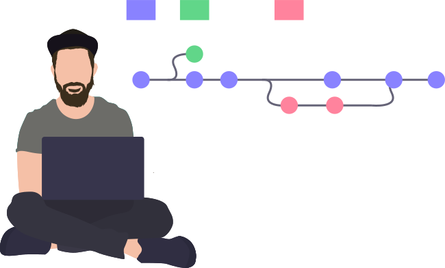

<h2 align="center">Hello there! My name is Dominik. 👋🤓</h2>

&nbsp;&nbsp;
&nbsp;&nbsp;
&nbsp;&nbsp;
&nbsp;&nbsp;

I'm a DevOps Engineer, Application Lifecycle Management Consultant, Photographer and Sportsman from Germany.
I help development teams to continuously tweak their Application Lifecycle Management. I advocate versioning everything to always be in control - and get a good night's sleep. My everyday work revolves around <b>DevOps</b> Topics, <b>Automation</b>, <b>CI/CD</b>, <b>Containerization</b>, <b>Infrastructure as Code</b>,  and more than anything:    <b style="text-transform:uppercase;font-size:24px">collaborating with people!</b> 

 

**My Technologie Stack:**  

<code></code>
<code></code>
<code></code>
<code></code>
<code></code>
<code></code>
<code></code>
<code></code>
<code></code>
<code></code>
<code></code>
<code></code>
<code></code>
<code></code>
<code></code>
<code></code>
<code></code>
<code></code>
<code></code>
<code></code>
<code></code>

 
